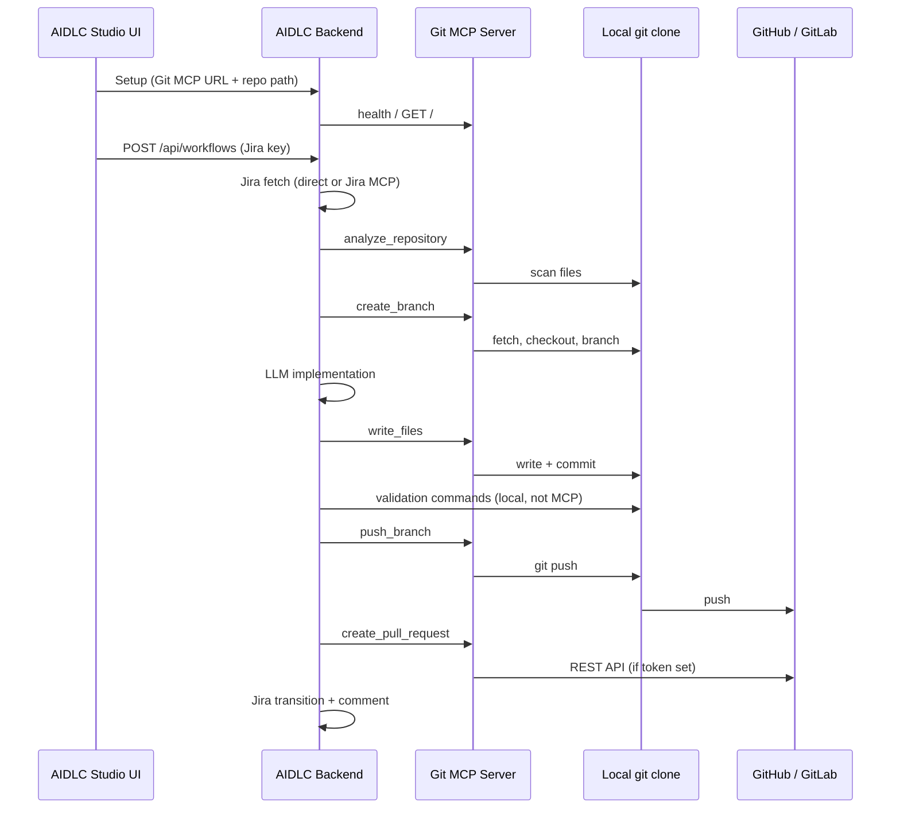

# AIDLC Git MCP Server

HTTP MCP adapter for [AIDLC Studio](../../README.md) **Git · MCP** mode. It exposes the tool names configured in `backend/config/policy.yaml`:

| Policy logical key | HTTP tool `name` |
|---|---|
| `analyze` | `analyze_repository` |
| `branch` | `create_branch` |
| `write` | `write_files` |
| `push` | `push_branch` |
| `pr` | `create_pull_request` |

Setup validation also calls tool `health` (optional; GET `/git/` works as fallback).

## Prerequisites

- Python 3.11+
- [Git](https://git-scm.com/) on `PATH`
- A **local clone** of the target repo (same path you enter in AIDLC Studio setup)
- `GITHUB_TOKEN` and/or `GITLAB_TOKEN` in `.env` with **push** and **pull request** scopes for the target repo

## Install and run

From the repository root:

```powershell
cd mcp-servers/git
python -m venv .venv
.\.venv\Scripts\Activate.ps1
pip install -r requirements.txt
copy .env.example .env
# Edit .env: GITHUB_TOKEN and/or GITLAB_TOKEN if you want automated PR/MR creation
python -m uvicorn app.main:app --host 127.0.0.1 --port 9002 --reload

```

Server base URL for the studio: **`http://127.0.0.1:9002/git`**

Health check:

```powershell
curl http://127.0.0.1:9002/git/
```

Example tool call (same shape as AIDLC `ExternalMCPClient`):

```powershell
curl -X POST http://127.0.0.1:9002/git/tools/call `
  -H "Content-Type: application/json" `
  -d "{\"name\":\"health\",\"arguments\":{}}"
```

The AIDLC backend also accepts `POST /git/mcp/tools/call` and JSON-RPC `tools/call` on `POST /git` (see `app/main.py`).

## Wire AIDLC Studio

1. Start this server (port `9002`).
2. Start AIDLC backend + frontend (see root [README](../../README.md)).
3. In the setup wizard:
   - **Git** mode: **MCP**
   - **MCP URL**: `http://127.0.0.1:9002/git`
   - **Repository path**: absolute path to your local clone (still required for branch listing in the UI)
4. Optional in `backend/.env`:

```env
GIT_MCP_URL=http://127.0.0.1:9002/git
GIT_MCP_TOKEN=
```

Tool name mapping stays in `backend/config/policy.yaml` under `mcp.git.tools` (defaults match this server).

## End-to-end workflow



### What runs where

| Step | MCP? | Notes |
|---|---|---|
| Branch list in setup | No | Backend runs `git` locally using **repository path** |
| `analyze_repository` | Yes | Repo context for planning |
| `create_branch` | Yes | Uses `jira_key` + summary for `ai/{key}-…` branch names |
| `write_files` | Yes | Commits on current branch |
| Validation (`pytest`, etc.) | No | Runs in repo path on the AIDLC machine |
| `push_branch` | Yes | HTTPS push using `GITHUB_TOKEN` / `GITLAB_TOKEN` (no Credential Manager popup) |
| `create_pull_request` | Yes | GitHub or GitLab REST API (same tokens as push) |

### Host tokens (GitHub / GitLab) — push and pull requests

- Detects host from `git remote get-url` (`github.com` → GitHub, `gitlab` in URL → GitLab).
- **Push**: `git push` to an authenticated HTTPS URL built from the token (`x-access-token` on GitHub, `oauth2` on GitLab). **Required** — local SSH / Credential Manager is not used (`GIT_TERMINAL_PROMPT=0`).
- **Pull request / MR**: REST API with the same token resolution.
- Token resolution: optional tool arg → `GITHUB_TOKEN` / `GITLAB_TOKEN` in this server's `.env` → process environment.
- **GitHub PR API**: `Authorization: Bearer` + `POST /repos/{owner}/{repo}/pulls`.
- **GitLab MR API**: `PRIVATE-TOKEN` + `POST /api/v4/projects/{id}/merge_requests`. Base URL: `GITLAB_BASE_URL` (default `https://gitlab.com`).
- Without a token, push **fails** with a clear error; PR/MR returns **DRAFT** with a compare / new-MR URL.

AIDLC backend calls this server over **Git MCP** (`POST …/tools/call`, with optional `Authorization: Bearer` from `GIT_MCP_TOKEN`; this server does not validate that header). **GITHUB_TOKEN** / **GITLAB_TOKEN** belong in `mcp-servers/git/.env` for push and PR/MR.

## Customizing

- **Rename tools**: change `mcp.git.tools` in `backend/config/policy.yaml` and register matching HTTP names in `app/tools.py` `TOOL_REGISTRY`.
- **Default remote / base branch**: set `GIT_REMOTE` and `GIT_BASE_BRANCH` in `.env` (see `.env.example`).
- **Self-hosted GitLab**: set `GITLAB_BASE_URL=https://gitlab.mycompany.com`.

## Project layout

```
mcp-servers/git/
  app/
    main.py      # FastAPI app (routes under /git)
    tools.py     # Tool dispatch
    git_ops.py   # Git CLI + GitHub/GitLab API
    config.py    # Environment settings
  requirements.txt
  .env.example
```
